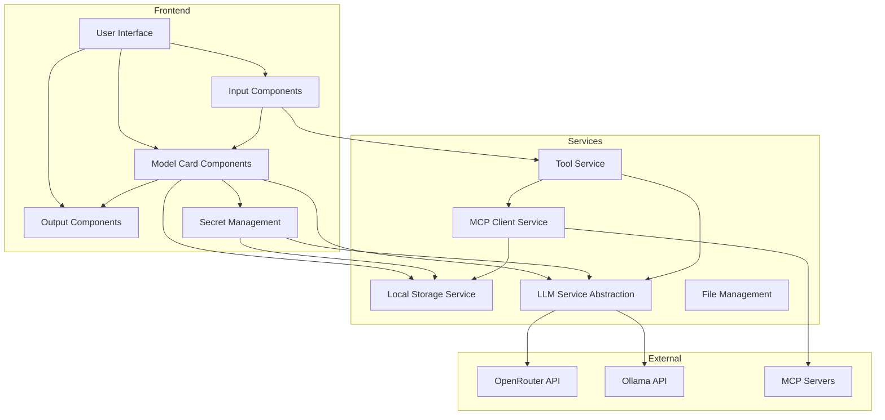

# Revised Blueprint and Phase-wise Implementation Plan for Model Card Application

## System Architecture



## Core Components

### 1. Model Card Component
- React component with editable parameters
- Ability to connect to other model cards or output components
- Integration with LLM service
- Parameter configuration UI
- Model capability validation for file, image, tools, audio support
- Validation of model compatibility before accepting for model card

### 2. Input Component
- Text input (rich text editor)
- File upload (images, documents)
- Audio recording/upload
- Input validation and preprocessing
- Tool integration from MCP or other sources
- Tool selection and configuration UI

### 3. Output Component
- Text/Markdown rendering
- Copy functionality
- Export options (text, markdown, PDF)
- Formatting options
- Tool usage responses display
- Usage statistics visualization

### 4. LLM Service
- Abstraction layer for LLM providers
- API key management
- Request/response handling
- Error handling and retry logic
- Specific integration with:
  - OpenRouter for cloud LLM services
  - Ollama for local models

### 5. Storage Service
- Client-side storage for conversation history
- Model card configurations
- User preferences
- Logs and analytics
- Adaptable design for future local database integration
- **MCP server settings storage**

### 6. Tool Service
- Integration with MCP tools
- Tool execution and response handling
- Tool capability validation
- Tool usage logging

### 7. MCP Client Service
- **Add/remove/update MCP servers**
- **Act as MCP Client to call MCP Servers**
- **Persist MCP server settings**
- **Enable/disable MCP servers at server level**
- **Store MCP settings as JSON in LocalStorage**
- MCP server discovery and connection management

### 8. Workflow Management
- Connect model cards
- Data flow between components
- Simple pipeline creation

## Phase-wise Implementation Plan

### Phase 1: Foundation (Weeks 1-2)

**Goals:**
- Set up project structure
- Implement basic UI components
- Create core service abstractions
- **Implement MCP Client Service foundation**

**Tasks:**
1. Set up project structure and dependencies
   - Add required packages (Daisy UI, Lucide icons, etc.)
   - Configure Tailwind CSS with Daisy UI
   - Set up folder structure for components, services, and utilities
   - Ensure Vite configuration is properly set up

2. Create basic UI components
   - Create basic layout components
   - Implement navigation
   - Set up theme support (light/dark mode)

3. Implement service abstractions
   - Create LLM service interface with OpenRouter and Ollama adapters
   - Implement local storage service with adaptable design for future DB integration
   - Set up environment variable handling
   - Create tool service interface for MCP integration

4. **Implement MCP Client Service foundation**
   - **Create MCP client interface**
   - **Implement basic MCP server connection handling**
   - **Create storage schema for MCP server settings**
   - **Implement LocalStorage adapter for MCP settings**

**Deliverables:**
- Project structure with all dependencies
- Basic UI components and layout
- Service interfaces and implementations
- **Basic MCP Client Service implementation**

### Phase 2: Core Components (Weeks 3-4)

**Goals:**
- Implement model card component
- Create input and output components
- Integrate with LLM service
- Implement tool service
- **Enhance MCP Client Service**

**Tasks:**
1. Implement model card component
   - Create model card UI
   - Implement parameter configuration
   - Add state management for model card data
   - Add model capability validation for file, image, tools, audio

2. Create input components
   - Implement text input with rich text editor
   - Add file upload functionality
   - Implement audio recording/upload
   - Add tool selection and configuration UI

3. Create output components
   - Implement markdown rendering
   - Add copy functionality
   - Implement export options
   - Add tool usage response display
   - Add usage statistics visualization

4. Integrate with LLM service
   - Implement API clients for OpenRouter and Ollama
   - Add request/response handling
   - Implement error handling and retry logic

5. Implement tool service
   - Create MCP tool integration
   - Implement tool execution and response handling
   - Add tool capability validation

6. **Enhance MCP Client Service**
   - **Implement MCP server management UI**
   - **Add server add/remove/update functionality**
   - **Implement server enable/disable toggle**
   - **Create MCP settings persistence layer**

**Deliverables:**
- Functional model card component with capability validation
- Input components for text, file, audio, and tools
- Output components with rendering, export options, and usage statistics
- LLM service integration with OpenRouter and Ollama
- Tool service integration with MCP
- **Complete MCP Client Service with management UI**

### Phase 3: Workflow and Connections (Weeks 5-6)

**Goals:**
- Implement model card connections
- Create workflow management
- Add secret management
- Enhance tool integration
- **Integrate MCP Client with Model Cards**

**Tasks:**
1. Implement model card connections
   - Create connection UI
   - Implement data flow between model cards
   - Add validation for connections
   - Ensure tool data flows correctly between components

2. Create workflow management
   - Implement workflow UI
   - Add workflow execution
   - Implement workflow saving and loading
   - Add tool execution orchestration

3. Add secret management
   - Create UI for managing API keys
   - Implement secure storage for secrets
   - Add environment variable configuration

4. Enhance tool integration
   - Improve tool discovery and selection
   - Add tool usage analytics
   - Implement tool error handling

5. **Integrate MCP Client with Model Cards**
   - **Connect model cards to MCP servers**
   - **Implement MCP tool discovery and selection**
   - **Add MCP server status monitoring**
   - **Create MCP server testing functionality**

**Deliverables:**
- Model card connection functionality
- Workflow management UI and logic
- Secret management UI and implementation
- Enhanced tool integration
- **Model Card to MCP Server integration**

### Phase 4: Polish and Optimization (Weeks 7-8)

**Goals:**
- Improve UI/UX
- Optimize performance
- Add logging and analytics
- Prepare for deployment
- **Finalize MCP integration**

**Tasks:**
1. Improve UI/UX
   - Refine component styling
   - Add animations and transitions
   - Improve responsive design
   - Enhance tool usage experience
   - **Improve MCP server management UI**

2. Optimize performance
   - Implement lazy loading
   - Add caching for LLM responses
   - Optimize rendering performance
   - Optimize tool execution
   - **Optimize MCP server connections**

3. Add logging and analytics
   - Implement logging service
   - Add usage analytics
   - Create debug tools
   - Add detailed tool usage analytics
   - **Add MCP server usage analytics**

4. Prepare for deployment
   - Configure build process for production
   - Set up environment-specific configurations
   - Create deployment documentation
   - Ensure compatibility with web hosting platforms
   - **Document MCP server setup and configuration**

**Deliverables:**
- Polished UI/UX
- Optimized performance
- Logging and analytics implementation
- Deployment-ready application
- **Complete MCP server integration documentation**

## Technical Considerations

### State Management
- Use React's Context API for global state
- Consider RxJS for reactive state management where appropriate
- Use local component state for UI-specific state
- **Use LocalStorage for MCP server settings persistence**

### API Integration
- Create adapters specifically for OpenRouter and Ollama
- Use environment variables for API keys and configuration
- Implement robust error handling for API calls
- **Implement MCP protocol for server communication**

### Storage
- Use browser's localStorage/IndexedDB for client-side storage
- Design storage service with adapter pattern for future local DB integration
- Implement data migration strategy for schema updates
- Add export/import functionality for user data
- **Store MCP settings as JSON objects in LocalStorage**

### Performance
- Implement virtualization for large lists
- Use React.memo and useMemo for expensive computations
- Implement code splitting for large components
- Optimize tool execution and response handling
- **Implement connection pooling for MCP servers**

### Security
- Securely handle API keys and secrets
- Implement input sanitization
- Add rate limiting for API requests
- Validate tool inputs and outputs
- **Validate MCP server connections and responses**

## Data Models

### Model Card
```typescript
interface ModelCard {
  id: string;
  name: string;
  description: string;
  parameters: Parameter[];
  inputConnections: Connection[];
  outputConnections: Connection[];
  llmProvider: 'openrouter' | 'ollama';
  llmModel: string;
  capabilities: ModelCapabilities;
  mcpServers?: string[]; // IDs of connected MCP servers
  createdAt: Date;
  updatedAt: Date;
}

interface ModelCapabilities {
  supportsImages: boolean;
  supportsAudio: boolean;
  supportsFiles: boolean;
  supportsTools: boolean;
  supportedToolTypes: string[];
}

interface Parameter {
  id: string;
  name: string;
  type: 'string' | 'number' | 'boolean' | 'select';
  value: any;
  options?: string[]; // For select type
  description?: string;
}

interface Connection {
  id: string;
  sourceId: string;
  targetId: string;
  type: 'model-to-model' | 'input-to-model' | 'model-to-output';
}
```

### Input
```typescript
interface Input {
  id: string;
  type: 'text' | 'file' | 'audio' | 'tool';
  content: string | File | AudioBuffer | Tool;
  metadata: Record<string, any>;
}

interface Tool {
  id: string;
  name: string;
  type: 'mcp' | 'custom';
  mcpServerId?: string; // ID of the MCP server providing this tool
  configuration: Record<string, any>;
  description?: string;
}
```

### Output
```typescript
interface Output {
  id: string;
  type: 'text' | 'markdown';
  content: string;
  toolResponses?: ToolResponse[];
  usageStatistics: UsageStatistics;
  metadata: Record<string, any>;
}

interface ToolResponse {
  toolId: string;
  toolName: string;
  mcpServerId?: string; // ID of the MCP server that processed the tool
  response: any;
  timestamp: Date;
  status: 'success' | 'error' | 'pending';
}

interface UsageStatistics {
  promptTokens: number;
  completionTokens: number;
  totalTokens: number;
  executionTime: number;
  toolCalls: number;
}
```

### LLM Request/Response
```typescript
interface LLMRequest {
  provider: 'openrouter' | 'ollama';
  model: string;
  prompt: string;
  parameters: Record<string, any>;
  tools?: Tool[];
  files?: File[];
}

interface LLMResponse {
  id: string;
  content: string;
  toolResults?: ToolResult[];
  usage: {
    promptTokens: number;
    completionTokens: number;
    totalTokens: number;
  };
  metadata: Record<string, any>;
}

interface ToolResult {
  toolId: string;
  mcpServerId?: string;
  result: any;
  error?: string;
}
```

### MCP Server
```typescript
interface MCPServer {
  id: string;
  name: string;
  url: string;
  type: 'stdio' | 'sse';
  enabled: boolean;
  status: 'connected' | 'disconnected' | 'error';
  tools: MCPTool[];
  resources: MCPResource[];
  settings: Record<string, any>;
  createdAt: Date;
  updatedAt: Date;
}

interface MCPTool {
  id: string;
  name: string;
  description: string;
  inputSchema: Record<string, any>;
  outputSchema: Record<string, any>;
}

interface MCPResource {
  id: string;
  uri: string;
  description: string;
}
```

## Folder Structure

```
/app
  /components
    /model-card
      ModelCard.tsx
      ModelCardEditor.tsx
      ModelCardConnector.tsx
      ModelCardRenderer.tsx
      ModelCapabilityValidator.tsx
    /input
      TextInput.tsx
      FileInput.tsx
      AudioInput.tsx
      ToolInput.tsx
    /output
      OutputRenderer.tsx
      ExportOptions.tsx
      ToolResponseDisplay.tsx
      UsageStatistics.tsx
    /tool
      ToolSelector.tsx
      ToolConfigurator.tsx
      ToolExecutor.tsx
    /mcp
      MCPServerList.tsx
      MCPServerEditor.tsx
      MCPServerStatus.tsx
      MCPToolSelector.tsx
    /ui
      Layout.tsx
      Navigation.tsx
      ThemeToggle.tsx
  /services
    /llm
      LLMService.ts
      OpenRouterAdapter.ts
      OllamaAdapter.ts
    /storage
      StorageService.ts
      LocalStorageAdapter.ts
      DatabaseAdapter.ts (placeholder for future)
    /file
      FileService.ts
    /secret
      SecretService.ts
    /tool
      ToolService.ts
      MCPToolAdapter.ts
    /mcp
      MCPClientService.ts
      MCPServerManager.ts
      MCPConnectionHandler.ts
      MCPSettingsStorage.ts
  /utils
    api.ts
    formatting.ts
    validation.ts
  /hooks
    useLLM.ts
    useModelCard.ts
    useStorage.ts
    useTool.ts
    useMCPServer.ts
  /context
    ModelCardContext.tsx
    WorkflowContext.tsx
    ThemeContext.tsx
    ToolContext.tsx
    MCPContext.tsx
  /pages
    Home.tsx
    ModelCardEditor.tsx
    WorkflowEditor.tsx
    Settings.tsx
    MCPServerManager.tsx
  /types
    index.ts
```

## Dependencies to Add

```json
{
  "dependencies": {
    "daisyui": "^4.0.0",
    "lucide-react": "^0.300.0",
    "marked": "^9.0.0",
    "react-markdown": "^9.0.0",
    "uuid": "^9.0.0",
    "zod": "^3.22.0",
    "jotai": "^2.5.0",
    "react-dropzone": "^14.2.3",
    "react-hook-form": "^7.46.0",
    "html-to-image": "^1.11.11",
    "file-saver": "^2.0.5",
    "rxjs": "^7.8.1",
    "socket.io-client": "^4.7.2"
  },
  "devDependencies": {
    "@types/uuid": "^9.0.0",
    "@types/file-saver": "^2.0.5"
  }
}
```