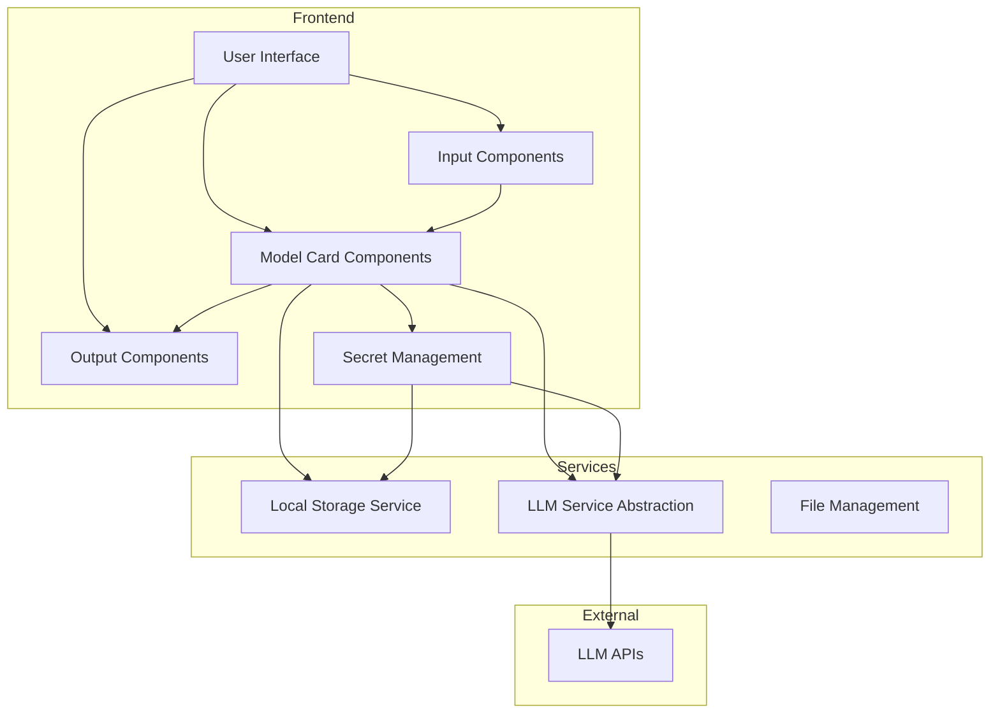

# Blueprint and Phase-wise Implementation Plan for Model Card Application

## System Architecture



## Core Components

### 1. Model Card Component
- React component with editable parameters
- Ability to connect to other model cards or output components
- Integration with LLM service
- Parameter configuration UI

### 2. Input Component
- Text input (rich text editor)
- File upload (images, documents)
- Audio recording/upload
- Input validation and preprocessing

### 3. Output Component
- Text/Markdown rendering
- Copy functionality
- Export options (text, markdown, PDF)
- Formatting options

### 4. LLM Service
- Abstraction layer for different LLM providers
- API key management
- Request/response handling
- Error handling and retry logic

### 5. Storage Service
- Local storage for conversation history
- Model card configurations
- User preferences
- Logs and analytics

### 6. Workflow Management
- Connect model cards
- Data flow between components
- Simple pipeline creation

## Phase-wise Implementation Plan

### Phase 1: Foundation (Weeks 1-2)

**Goals:**
- Set up project structure
- Implement basic UI components
- Create core service abstractions

**Tasks:**
1. Set up project structure and dependencies
   - Add required packages (Daisy UI, Lucide icons, etc.)
   - Configure Tailwind CSS with Daisy UI
   - Set up folder structure for components, services, and utilities

2. Create basic UI components
   - Create basic layout components
   - Implement navigation
   - Set up theme support (light/dark mode)

3. Implement service abstractions
   - Create LLM service interface
   - Implement local storage service
   - Set up environment variable handling

**Deliverables:**
- Project structure with all dependencies
- Basic UI components and layout
- Service interfaces and implementations

### Phase 2: Core Components (Weeks 3-4)

**Goals:**
- Implement model card component
- Create input and output components
- Integrate with LLM service

**Tasks:**
1. Implement model card component
   - Create model card UI
   - Implement parameter configuration
   - Add state management for model card data

2. Create input components
   - Implement text input with rich text editor
   - Add file upload functionality
   - Implement audio recording/upload

3. Create output components
   - Implement markdown rendering
   - Add copy functionality
   - Implement export options

4. Integrate with LLM service
   - Implement API client for LLM providers
   - Add request/response handling
   - Implement error handling and retry logic

**Deliverables:**
- Functional model card component
- Input components for text, file, and audio
- Output components with rendering and export options
- LLM service integration

### Phase 3: Workflow and Connections (Weeks 5-6)

**Goals:**
- Implement model card connections
- Create workflow management
- Add secret management

**Tasks:**
1. Implement model card connections
   - Create connection UI
   - Implement data flow between model cards
   - Add validation for connections

2. Create workflow management
   - Implement workflow UI
   - Add workflow execution
   - Implement workflow saving and loading

3. Add secret management
   - Create UI for managing API keys
   - Implement secure storage for secrets
   - Add environment variable configuration

**Deliverables:**
- Model card connection functionality
- Workflow management UI and logic
- Secret management UI and implementation

### Phase 4: Polish and Optimization (Weeks 7-8)

**Goals:**
- Improve UI/UX
- Optimize performance
- Add logging and analytics
- Prepare for deployment

**Tasks:**
1. Improve UI/UX
   - Refine component styling
   - Add animations and transitions
   - Improve responsive design

2. Optimize performance
   - Implement lazy loading
   - Add caching for LLM responses
   - Optimize rendering performance

3. Add logging and analytics
   - Implement logging service
   - Add usage analytics
   - Create debug tools

4. Prepare for deployment
   - Configure build process for production
   - Set up environment-specific configurations
   - Create deployment documentation

**Deliverables:**
- Polished UI/UX
- Optimized performance
- Logging and analytics implementation
- Deployment-ready application

## Technical Considerations

### State Management
- Use React's Context API for global state
- Consider RxJS for reactive state management where appropriate
- Use local component state for UI-specific state

### API Integration
- Create a provider-agnostic abstraction for LLM APIs
- Implement adapter pattern for different LLM providers
- Use environment variables for API keys and configuration

### Storage
- Use browser's localStorage/IndexedDB for client-side storage
- Implement data migration strategy for schema updates
- Add export/import functionality for user data

### Performance
- Implement virtualization for large lists
- Use React.memo and useMemo for expensive computations
- Implement code splitting for large components

### Security
- Securely handle API keys and secrets
- Implement input sanitization
- Add rate limiting for API requests

## Data Models

### Model Card
```typescript
interface ModelCard {
  id: string;
  name: string;
  description: string;
  parameters: Parameter[];
  inputConnections: Connection[];
  outputConnections: Connection[];
  llmProvider: string;
  llmModel: string;
  createdAt: Date;
  updatedAt: Date;
}

interface Parameter {
  id: string;
  name: string;
  type: 'string' | 'number' | 'boolean' | 'select';
  value: any;
  options?: string[]; // For select type
  description?: string;
}

interface Connection {
  id: string;
  sourceId: string;
  targetId: string;
  type: 'model-to-model' | 'input-to-model' | 'model-to-output';
}
```

### Input
```typescript
interface Input {
  id: string;
  type: 'text' | 'file' | 'audio';
  content: string | File | AudioBuffer;
  metadata: Record<string, any>;
}
```

### Output
```typescript
interface Output {
  id: string;
  type: 'text' | 'markdown';
  content: string;
  metadata: Record<string, any>;
}
```

### LLM Request/Response
```typescript
interface LLMRequest {
  provider: string;
  model: string;
  prompt: string;
  parameters: Record<string, any>;
  files?: File[];
}

interface LLMResponse {
  id: string;
  content: string;
  usage: {
    promptTokens: number;
    completionTokens: number;
    totalTokens: number;
  };
  metadata: Record<string, any>;
}
```

## Folder Structure

```
/app
  /components
    /model-card
      ModelCard.tsx
      ModelCardEditor.tsx
      ModelCardConnector.tsx
      ModelCardRenderer.tsx
    /input
      TextInput.tsx
      FileInput.tsx
      AudioInput.tsx
    /output
      OutputRenderer.tsx
      ExportOptions.tsx
    /ui
      Layout.tsx
      Navigation.tsx
      ThemeToggle.tsx
  /services
    /llm
      LLMService.ts
      OpenAIAdapter.ts
      AnthropicAdapter.ts
      LocalModelAdapter.ts
    /storage
      StorageService.ts
      LocalStorageAdapter.ts
    /file
      FileService.ts
    /secret
      SecretService.ts
  /utils
    api.ts
    formatting.ts
    validation.ts
  /hooks
    useLLM.ts
    useModelCard.ts
    useStorage.ts
  /context
    ModelCardContext.tsx
    WorkflowContext.tsx
    ThemeContext.tsx
  /pages
    Home.tsx
    ModelCardEditor.tsx
    WorkflowEditor.tsx
    Settings.tsx
  /types
    index.ts
```

## Dependencies to Add

```json
{
  "dependencies": {
    "daisyui": "^4.0.0",
    "lucide-react": "^0.300.0",
    "marked": "^9.0.0",
    "react-markdown": "^9.0.0",
    "uuid": "^9.0.0",
    "zod": "^3.22.0",
    "jotai": "^2.5.0",
    "react-dropzone": "^14.2.3",
    "react-hook-form": "^7.46.0",
    "html-to-image": "^1.11.11",
    "file-saver": "^2.0.5"
  },
  "devDependencies": {
    "@types/uuid": "^9.0.0",
    "@types/file-saver": "^2.0.5"
  }
}
```