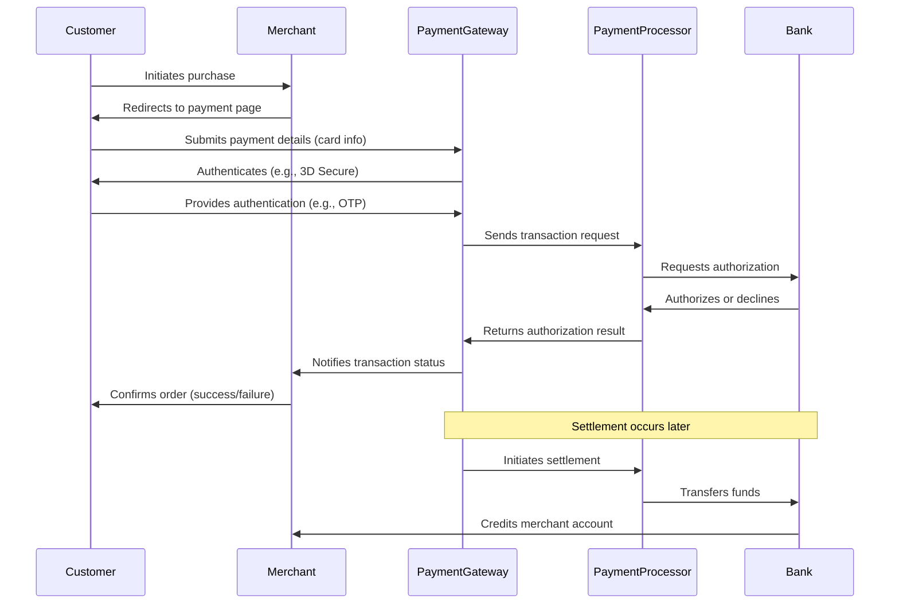
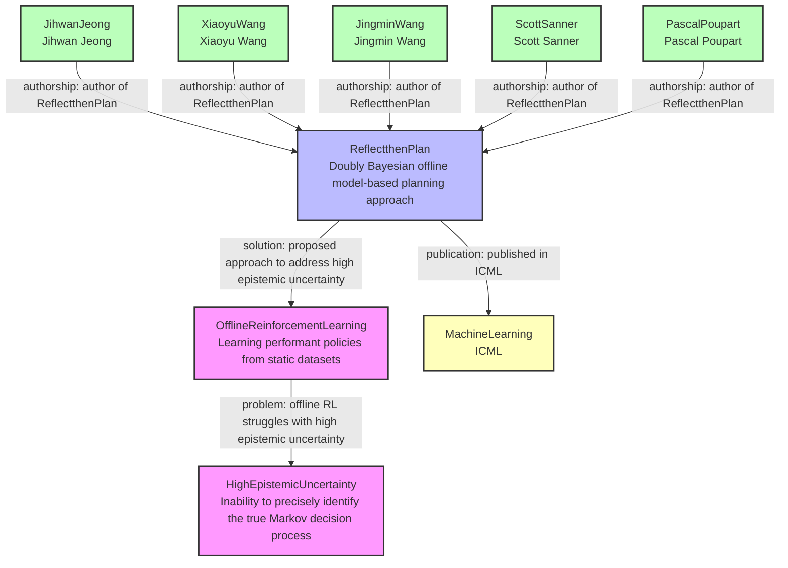

import ExpandableSnippet from '/snippets/expandable.mdx'

  This is a sample page to demonstrate text, titles, and styling in standard markdown.
## Titles

Best used for section headers.

## Snippets

<ExpandableSnippet/>


```md
## Titles
```

### Subtitles

Best use to subsection headers.

```md
### Subtitles
```

<Tip>

Each **title** and **subtitle** creates an anchor and also shows up on the table of contents on the right.

</Tip>

## Text Formatting

We support most markdown formatting. Simply add `**`, `_`, or `~` around text to format it.

| Style         | How to write it   | Result          |
| ------------- | ----------------- | --------------- |
| Bold          | `**bold**`        | **bold**        |
| Italic        | `_italic_`        | _italic_        |
| Strikethrough | `~strikethrough~` | ~strikethrough~ |

You can combine these. For example, write `**_bold and italic_**` to get **_bold and italic_** text.

You need to use HTML to write superscript and subscript text. That is, add `<sup>` or `<sub>` around your text.

| Text Size   | How to write it          | Result                 |
| ----------- | ------------------------ | ---------------------- |
| Superscript | `<sup>superscript</sup>` | <sup>superscript</sup> |
| Subscript   | `<sub>subscript</sub>`   | <sub>subscript</sub>   |

### Lists
We support both ordered and unordered lists.
#### Unordered Lists
```md
- Item 1
- Item 2
  - Subitem 1
  - Subitem 2
```

- Item 1
- Item 2
  - Subitem 1
  - Subitem 2
#### Ordered Lists
```md
1. Item 1
2. Item 2
   1. Subitem 1
   2. Subitem 2
```
1. Item 1
2. Item 2
   1. Subitem 1
   2. Subitem 2
### Blockquotes
You can create blockquotes by adding `>` before your text.

```md
> This is a blockquote.
> It can span multiple lines.
```
> This is a blockquote.
> It can span multiple lines.
### Code Blocks
You can create code blocks by adding three backticks (```) before and after your code. You can also specify the language for syntax highlighting.

```md
```javascript
function helloWorld() {
    console.log("Hello, world!");
}
```
```

```javascript
function helloWorld() {
    console.log("Hello, world!");
}
```
### Inline Code
You can create inline code by wrapping your text in single backticks (`).

```md
`This is inline code`
```
`This is inline code`
### Horizontal Rule
You can create a horizontal rule by adding three dashes (---) on a new line.

```md
---
```
---

### Callouts

<Note>This adds a note in the content</Note>

<Warning>This adds a warning in the content</Warning>

<Info>This adds an info message in the content</Info>

<Tip>This adds an important message in the content - a tip</Tip>

<Check>This adds a hint in the content with a check sign</Check>

### Columns

<Columns cols={2}>
  <Card title="First Card">
    Neque porro quisquam est qui dolorem ipsum quia dolor sit amet
  </Card>
  <Card title="Second Card" icon="code">
    ```javascript
    function helloWorld() {
        console.log("Hello, world!");
    }
    ```
  </Card>
</Columns>
<Columns cols={3}>
  <Card title="First Card">
    Neque porro quisquam est qui dolorem ipsum quia dolor sit amet
  </Card>
  <Card title="Second Card">
    Lorem ipsum dolor sit amet, consectetur adipiscing elit
  </Card>
  <Card title="Third Card">
    Sed do eiusmod tempor incididunt ut labore et dolore magna aliqua
  </Card>
</Columns>
<Columns cols={4}>
  <Card title="First Card">
    Neque porro quisquam est qui dolorem ipsum quia dolor sit amet
  </Card>
  <Card title="Second Card">
    Lorem ipsum dolor sit amet, consectetur adipiscing elit
  </Card>
  <Card title="Third Card">
    Sed do eiusmod tempor incididunt ut labore et dolore magna aliqua
  </Card>
  <Card title="Fourth Card">
    Ut enim ad minim veniam, quis nostrud exercitation ullamco laboris nisi ut aliquip ex ea commodo consequat
  </Card>
</Columns>

### CodeGroups

<CodeGroup>

```javascript helloWorld.js
console.log("Hello World");
```

```python hello_world.py
print('Hello World!')
```

```java HelloWorld.java
class HelloWorld {
    public static void main(String[] args) {
        System.out.println("Hello, World!");
    }
}
```

</CodeGroup>


### Properties

<ResponseField name="getThreshold" type="signal Object">
  <Expandable title="properties">
    <ResponseField name="signal_id" type="string" required>
      Signal Id
    </ResponseField>

    <ResponseField name="sample" type="[]number]" required>
      Array of numbers representing the signal sample
    </ResponseField>
    <ResponseField name="compressed" type="boolean" default="false"> 
        Indicates if the signal is compressed - default is false
    </ResponseField>
  </Expandable>
</ResponseField>


### Icons

<Icon icon="flag" size={32}  color="#F05733" /> This is an icon with a custom color and size.

### Mermaid



